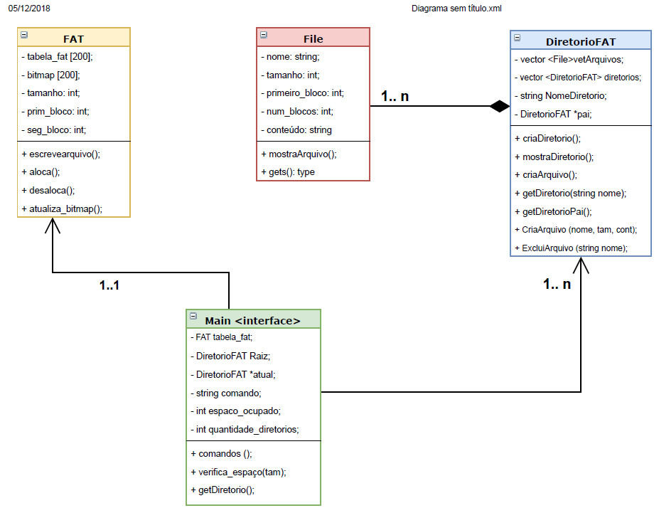

# Filesystem

Sistema de arquivos implementado seguindo o modelo FAT-32. 
Trabalho realizado para a cadeira de Sistemas Operacionais na Universidade Federal do Rio Grande (FURG)

- Cadeira: Sistemas Operacionais
- Ano: 2018
- Curso: Engenharia de Computação
- Professor: Odorico Machado

- Autor: Lucas Ribeiro

## Tecnologias Utilizadas

- C++ 
- FAT Algorithm 
- Dev-Cpp

---

Siga-me no linkedin: @luucasrb

*Agradecimentos a Vinicius Lucena pela contribuição*
